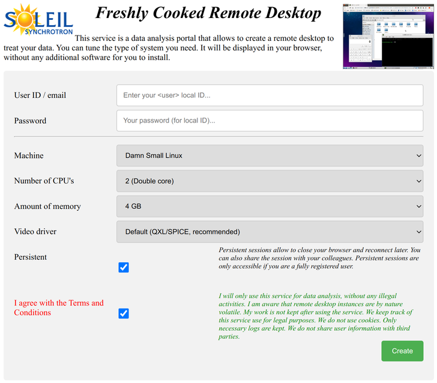
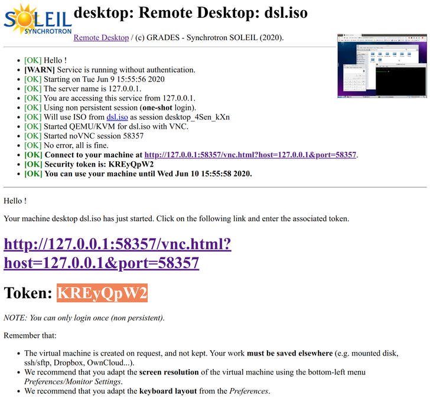
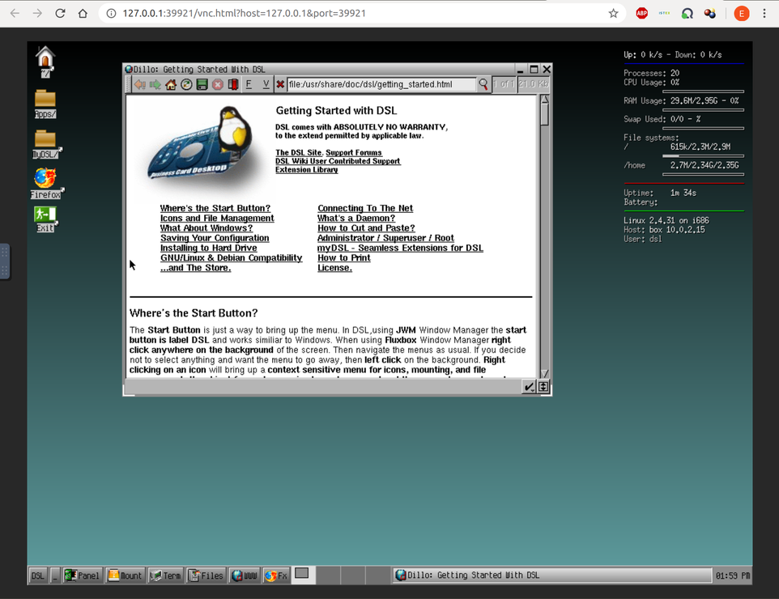

# remote-desktop
A remote desktop service that launches virtual machines and display them in your browser

What is provided by this service
================================

The service allows authorized users to launch a remote virtual machine, and display it in a browser window. No additional software installation is needed on the client side. This project has been developed on a Debian-class system, and is thus suited for it.

Once installed, connect to:
- http://server/desktop

Basically a user can enter some login/password or email, then specify what resources are needed (cpu, memory). It is also possible to select the type of machine (system), and if the machine is accessed only once, or can be accessed many times. After accepting the Terms and Conditions, the user can click on "Create".

<br>

<br>

The user credentials can be tested against IMAP, SMTP, and LDAP. In this case, a user ID (login name) and password are required. Authentication can also be achieved using an email sent with connection information.

When authentication is successful, a virtual machine is launched and can be displayed in the browser window. In most cases (this depends on the configuration - see below), a unique "token" is requested to secure the connection.

<br>

<br>

Just enter the given token, and you will access the virtual machine remote desktop. Use full screen, adapt screen resolution and keyboard layout, and you'll be good to go !

<br>

<br>

Features
--------
- Supports authentication using SMTP, IMAP, LDAP and email. See "customize" section below.
- Checks the server load to avoid DoS. See "customize" section below.
- Handles both single-shot login, and re-entrant (persistent) connections.
- Persistent connections allow to close the browser and re-connect later while the machine is still running. The connection information can also be shared to allow multiple users to collaborate. Beware: each will have mouse/keyboard control, so that friendly collaboration rules must be set in place.
- Single-shot connections only allow one single connection. Any browser closing or machine shutdown will imply to loose the virtual machine. However, this mode is lighter to handle for the server, and can be suited for e.g. tutorials and demo.
- No need to install anything on the client side.
- The rendering of the web service is responsive design. It adapts to the browser window size.

Installation
============

Install required packages. On a Debian-class system:
```bash
sudo apt install apache2 libapache2-mod-perl2
sudo apt install qemu-kvm bridge-utils qemu iptables dnsmasq
sudo apt install libcgi-pm-perl liblist-moreutils-perl libsys-cpu-perl libsys-cpuload-perl libsys-meminfo-perl libnet-dns-perl libproc-background-perl  libproc-processtable-perl libemail-valid-perl libnet-smtps-perl libmail-imapclient-perl libnet-ldap-perl libemail-valid-perl libjson-perl
```

Then make sure all is set-up:
```bash
sudo adduser www-data kvm
sudo chmod 755 /etc/qemu-ifup
```

- copy the html directory content into e.g. `/var/www/html` (Apache2 / Debian). You should now have a 'desktop' item there.
- copy the cgi-bin directory content into e.g. `/usr/lib/cgi-bin` (Apache2 / Debian).

The `cgi-bin` section of the Apache configuration file e.g. in `/etc/apache2/conf-available/serve-cgi-bin.conf` should be tuned as follows:
```
<Directory "/usr/lib/cgi-bin">
  ...
  SetHandler perl-script
  PerlResponseHandler ModPerl::Registry
  PerlOptions +ParseHeaders
</Directory> 
```

and finally:
```bash
sudo chown -R www-data /var/www/html/desktop
sudo find /var/www/html -type f -exec chmod a+r {} +
sudo find /var/www/html -type d -exec chmod a+rx {} +
sudo chmod 755 /usr/lib/cgi-bin/desktop.pl
sudo a2enmod cgi
sudo service apache2 restart
```

The noVNC (1.1.0) and websockify packages are included within this project.

Customize to your needs
=======================

Edit the `cgi-bin/desktop.pl` file, and its **service configuration** section (at the beginning of the file):
- adapt location of files (esp. directories to `machines`,`snapshots`).
- adapt the default specification of virtual machines (cpu, mem).
- adapt the restrictions for using the service (number of connections, load limit).
- adapt the user credential tests you wish to use. They are all tested one after the other, until one works.

Place any ISO, QCOW2, VDI, VMDK virtual machine file in the `html/desktop/machines` 
directory either local in the repo for testing, or in the HTML server e.g. at
`/var/www/html/desktop/machines`.

```bash
ls html/desktop/machines

dsl.iso   machine1.iso ...
```

Then edit the `html/desktop/index.html` web page in the:
- section `<label for="machine">Machine</label>`

and add entries to reflect the VM files in `html/machines`:
```html
<select id="machine" name="machine">
  <option value="dsl.iso">Damn Small Linux</option>
  <option value="machine1.iso">My superb VM</option>
  ...
</select>
```

This package provides a minimal ISO for testing (in `html/desktop/machines`):
- [Damn Small Linux aka DSL](http://www.damnsmalllinux.org/)

DSL does not properly work with modern systems. Expect strange behaviours with 
the mouse and keyboard. Use the `std` video driver or `--qemu_video=std` option, as proposed in the local test below.

Usage: local (for testing)
==========================

It is possible to test that all works by launching a Damn Small Linux distribution.

```bash
cd remote-desktop/src
perl cgi-bin/desktop.pl test --dir_service=html/desktop \
  --dir_html=html --dir_snapshots=/tmp --qemu_video=std
```

A text is displayed (HTML format) in the terminal, which indicates a URL.

Connect within a browser to the displayed IP, such as:
- http://localhost:38443/vnc.html?host=localhost&port=38443

for this test (executed as a script), there is no token to secure the VNC, as it is local.

Usage: as a web service
=======================

First make sure the service has been installed in the `html/desktop` root level of the host, and the `cgi-bin/desktop.pl` e.g. in the `/usr/lib/cgi-bin`.

Open a browser and go to the:
- http://localhost/desktop/

Customize your machine and launch it. Follow instructions, enter Token to connect the display. You can of course access the service remotely if the server is on a network.

Connect within a browser to the displayed IP, such as:
- http://localhost:38443/vnc.html?host=localhost&port=38443

and enter the displayed token (to secure the VNC connection), such as:
- 8nrnmcru

Credits
=======
(c) 2020 Emmanuel Farhi - GRADES - Synchrotron Soleil. AGPL3.


